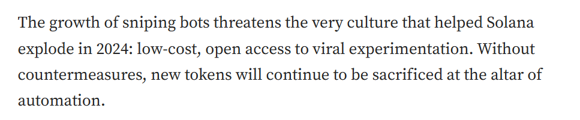
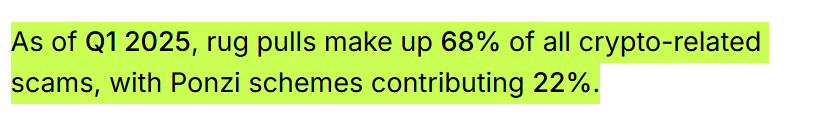

# Anti-Sniper and rug pull tool

### Problem Statement

**Decentralised launchpads struggle to deliver “fair launches” because automated *****sniper bots***** can buy huge allocations in the first block, then dump those tokens minutes later.**

### Why is this a good problem to solve?

1. Source: [https://medium.com/%40mbarichard18/sniped-on-arrival-unmasking-solanas-token-sniper-bots-and-securing-the-future-of-fair-launches-03fd6cc8b784](https://medium.com/%40mbarichard18/sniped-on-arrival-unmasking-solanas-token-sniper-bots-and-securing-the-future-of-fair-launches-03fd6cc8b784)

1. Source: [https://coinlaw.io/rug-pulls-amp-ponzi-schemes-in-crypto-statistics/#:~:text=As of Q1 2025%2C rug pulls make up 68%25 of all crypto-related scams%2C with Ponzi schemes contributing 22%25](https://coinlaw.io/rug-pulls-amp-ponzi-schemes-in-crypto-statistics/#:~:text=As%20of%20Q1%202025%2C%20rug%20pulls%20make%20up%2068%25%20of%20all%20crypto%2Drelated%20scams%2C%20with%20Ponzi%20schemes%20contributing%2022%25).

1. Cointelegraph flagged a launchpad (“Rugproof”) where insiders dumped liquidity minutes after launch, mirroring a rug pull. ( Source: [https://cointelegraph.com/news/bubblemaps-rugproof-launchpad-alleged-rug-pull](https://cointelegraph.com/news/bubblemaps-rugproof-launchpad-alleged-rug-pull))

**Conclusion**: This flash dumping triggers double‑digit price crashes, scares away genuine retail users, and forces honest projects to over‑incentivise liquidity just to be trusted. This is a real problem, and it hurts both the builders and the buyers.

#### 
Ideating solutions

1. Locking the first X blocks: So the sniper can buy the tokens in the firt hour, but can’t sell

1. Upsurged tax on early sell: This makes flash dump unprofitable

1. Cool-down timer: The address must hold tokens for≥ N blocks before the first transfer; attempts revert.

1. Linking with [passport.xyz](http://passport.xyz) and only allowing a score above 15 to sell the token: this makes sure the account holder is a human and not a sniper bot

#### Success Metrics (KPIs)

- % reduction in sniper bot participation

- % of retail wallets holding > 24h after launch

- Drop in post-launch volatility (e.g., <10% price crash in first 24h)

- Increase in repeat projects choosing the launchpad

Next steps

- GitHub-linked proof-of-work vesting

- Discord AMAs inside the dashboard

- DAO-based unlock voting

- zk-passport based anti-bot gating
