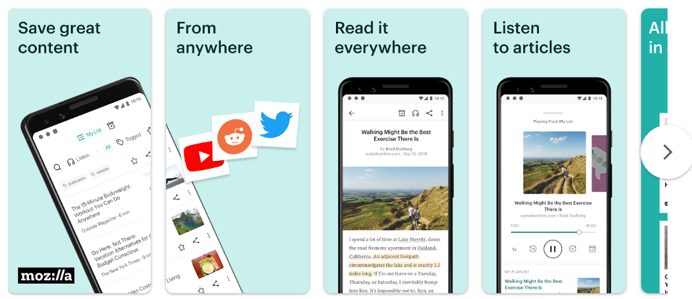

# Favourite Product breakdown

Ques: Take your favourite app and conduct a breakdown of the design. Critic on what you think is done right and wrong. Try to be as detailed as possible and suggest what can be improved.

My favourite app is: Pocket

The good points about the app are the following:

1. How useful is it?

  1. It facilitates reading of articles/ blogs without the need to subscribe to newsletters

1. How innovative is it?

  1. It has many categories and personalised dashboard based on what you usually read.

  1. It has a text-to-voice feature enabling listing to a article like a podcast.

1. Is the product easy to use and understood? Yes

  1. Clear call to action and a clean UI

What could have been better:

1. Showing meanings/ synonyms for complicated words

1. Addition of a Sleep Timer

1. The ability to add articles in a Queue for a continous narration
