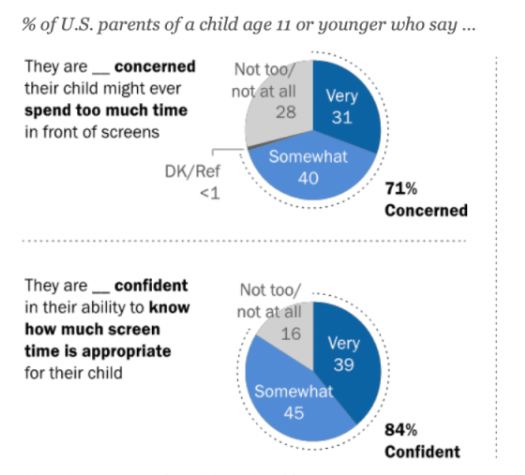
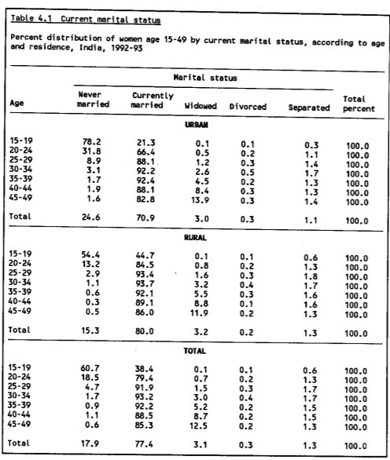

# Product Management (Parentry.app) Challenge | CoinedOne 

# Problem Statement

## Solution: (by Satavisha Mitra)

### Pain points of parents and children (user research)

1. Parents are concerned that children spend too much time on screen.

1. Multitasking from an early age diminishes the concentration power of a child. [\[1\]](https://www.kqed.org/mindshift/28561/how-does-multitasking-change-the-way-kids-learn)

1. Digital generation gap between parents and children. [\[2\]](https://us.norton.com/internetsecurity-how-to-digital-generations.html)

1. High risk of childhood obesity due to high screen time. [\[3\]](https://www.childrenandscreens.com/findings/obesity/)

1. Children, with screen addiction, avoid real-life social interactions, leading to social disabilities in the future. [\[4\]](https://online.regiscollege.edu/blog/effects-of-technology-on-children/)

1. Young children feel the pressure to look/ behave a certain way because this is something that is been praised in social media apps. This leads to increased insecurities about looks.

1. Children lack self-discipline because of the overuse of technology which renders instant gratification.[\[5\]](https://daily.jstor.org/whats-bad-instant-gratification/)

Screenshot from [PEW Research Center "Parenting Children in the Age of Screens"](https://www.pewresearch.org/internet/2020/07/28/parenting-children-in-the-age-of-screens/#fn-26219-1)

#### Potential solutions to cater to the pain points:

1. Tracking phone usage.

1. Restricting foul words/ disturbing media content.

1. Encouraging more family time, for both parents and children

1. Encouraging physical activities for the children.

### My Theme

Building **GetFit**** **by Parentry, a parenting app to track children’s health.

#### Initial Focus

- Children have increased eating while using screens.

- High chances of seeing advertising for high-calorie, low-nutrition foods, and beverages that alter children’s preferences, purchase requests, and eating habits.

- High exposure to white light (from screens/TV), might lead to disrupted sleep, which may affect appetite-related hormones, food choices, and more snacking and eating outside of normal mealtimes.

  - Frequently disrupted sleep can also affect a child’s mental wellbeing.

- Children, addicted to online gaming would prefer to play video games over going outdoors, socializing, and playing with friends.

Sources: [\[6\]](https://www.childrenandscreens.com/findings/obesity/#:~:text=The%20evidence%20to%20date%20suggests,beverages%20that%20alters%20children's%20preferences%2C), [\[7\]](https://www.ncbi.nlm.nih.gov/pmc/articles/PMC5769928/)

#### Proposal

**GetFit **by Parentry

- To launch a feature of Parentry that encourages healthy lifestyle choices.

- Promoting physical activities for children

- Promoting meditation for both parents and children

- Suggesting healthy and fun recipes to the parents

- Encouraging parents to do outdoor activities with children (offline game suggestions/ reminders to go for an evening walk together)

#### Total Addressable Market

India has ~40,00,00,000 people aged 25-50

Percentage of married people aged 25-50 : 90%

Percentage of childless couples in India : [5](https://www.ncbi.nlm.nih.gov/pmc/articles/PMC4188020/#:~:text=Childlessness%20in%20India%20is%20estimated,for%2045%2D49%20age%20group.)%

Percentage of India’s urban population: [35](https://tradingeconomics.com/india/urban-population-percent-of-total-wb-data.html#:~:text=Urban%20population%20(%25%20of%20total%20population)%20in%20India%20was%20reported,compiled%20from%20officially%20recognized%20sources.)%

Hence, TAM = 40cr*90%*95%*35%

= ~12,00,00,000 people

Table extracted from [http://rchiips.org/nfhs/data/india1/iachap4.pdf](http://rchiips.org/nfhs/data/india1/iachap4.pdf)

### Design Sprint

#### Set the Stage

**Background**

- Parentry helps parents make informed choices for their child’s digital activities. It helps parents to balance work and child’s schooling efficiently.

**Problem**

- Children nowadays spend too much time online. This hampers their sleep cycles, eating habits, and physical well being.

**Solution**

- Introducing a feature in Parentry that encourages regular physical activities, helps parents manage children’s healthy diet as per their BMI, and helps children with meditations.

#### **Prototyping**

You can access the prototype **[here.](https://www.figma.com/file/xerZ47dtiAMYoxWNaETyaP/GetFit-by-Parentry?node-id=0%3A1)**

[GetFit by Parentry](https://www.figma.com/file/xerZ47dtiAMYoxWNaETyaP/GetFit-by-Parentry?type=design&node-id=0-1&mode=design)

#### Success Metric

This can be Measured by:

- Parents’ active app usage time

- Number of times an activity is logged by parent

- Number of weeks children’s weight is updated.

- App’s feedback

#### Key Features and Scope

We are building an app, GetFit for Parentry which will help parents keep a track of their children’s health. The app will recommend physical activities to children, based on their age, weight and height. *(Note: P0 = High Priority, P1= Medium Priority, P2= Low Priority)*

| Priority | Feature | Description |
| --- | --- | --- |
| P0 | Welcome | A welcome page for parents to sign in |
| P0 | Logging Physical Activities | A page where parents can log childrens' daily physical activities |
| P0 | Evaluate Child's health | The app will calculate a child's BMI according to age and recommend lifestyle changes. |
| P0 | Children's Progress | A page which displays cumulative data of children's health progress |
| P1 | Meal Recommendations | The app will recommend meals to the parents |
| P1 | Activity Recommendation | The app will recommend fun social activities that parents can do with children |
| P1 | Meditations | The app will recommend guided meditations for both parents and children. |
| P2 | Blogs | The app will recommend health related blogs |
| P2 | Community | A forum where parents can share their story, comment on posts, and connect with others. |
