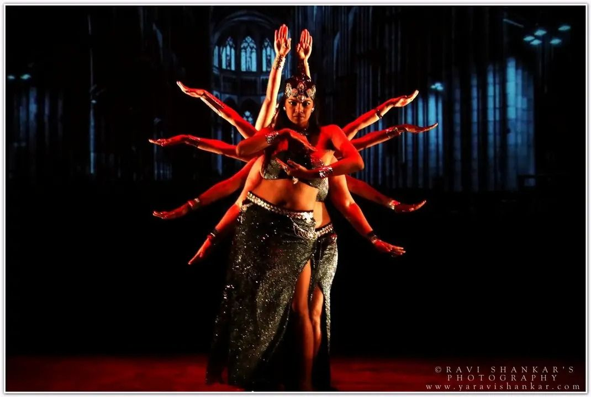

# Performed at NrityaKosh, Bengaluru

After months of rigorous practice and countless hours spent stitching our costumes and headgear by hand, the moment finally arrived—our team performed at a fundraiser hosted by **NrityaKosh, Bangalore**.

**Tribal Fusion Belly Dance (TFBD) **often blends dance forms like **American Tribal Style (ATS), cabaret belly dance, flamenco, hip hop, and gothic aesthetics** to create a mosiac of movement language.

This particular performance fused temple-style grace with gothic intensity. It told the story of a warrior—defeated, yet unbroken—who rises again. ✨ An ode to **resilience **✨.
