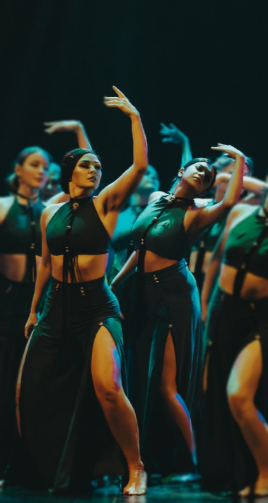
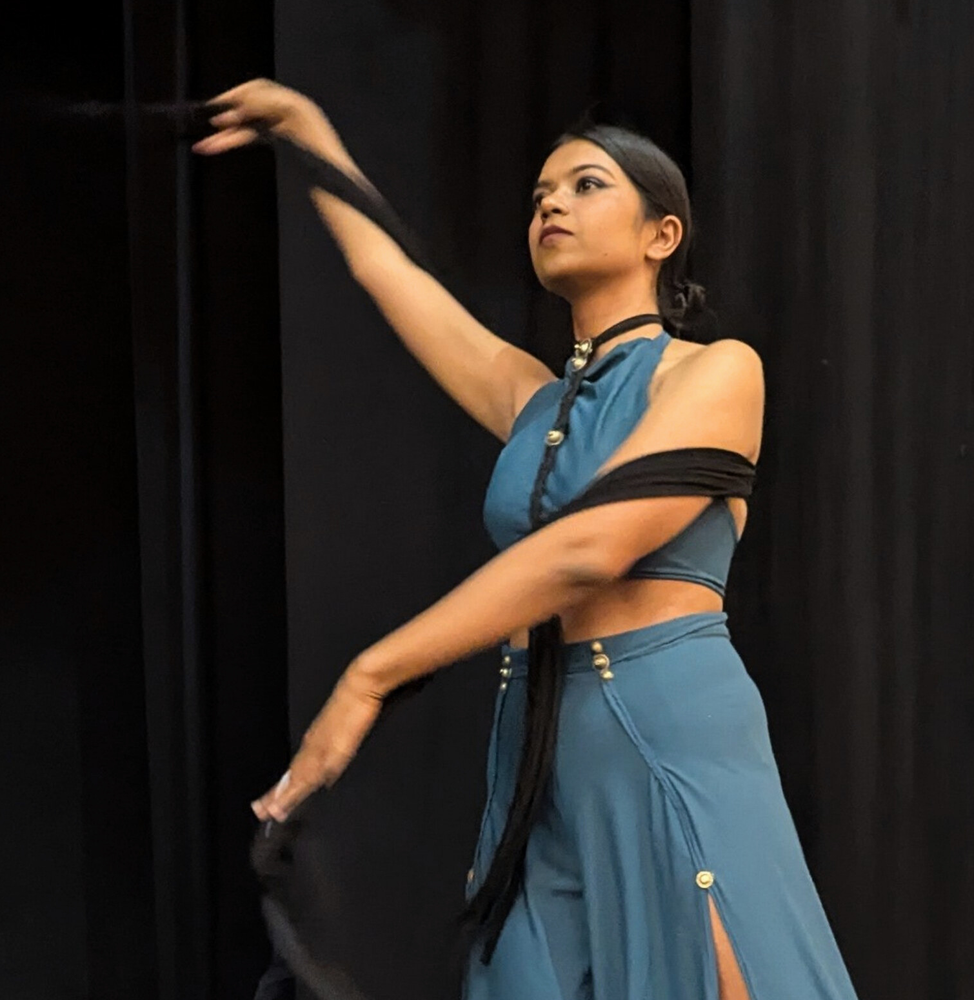

# Performed with the legendary Olga Meos, at Tribal Kazaksthan 2025

Held in **Astana, Kazakhstan**, *Tribal KZ* is the biggest Tribal Fusion Belly Dance event in Asia—a 7-day celebration where dancers from across the globe come together to **learn, collaborate, and create**.

✨ I had the incredible opportunity to learn from and perform alongside the legendary **Olga Meos**, a pioneer of the **isolation style in TFBD**. Sharing the stage and training space with her was a dream come true.

Throughout the festival, I also learned from some of the most influential artists in the global TFBD community:

- **Milana** – introduced us to *archetypes* in dance, showing how personality and narrative can be embodied through movement.

- **Deepika Vijay** – demonstrated the art of *layering and isolations* with grace and precision.

- **Illan Rivera** – known as the *king of movement*, taught us how *fluidity and geometry* can merge seamlessly.

- **Nivetha** – beautifully illustrated how *mind, body, and music* intertwine in performance.

- **Alina** – showcased *fusion of ballet and TFBD*, a style I witnessed for the first time.

💫 Those seven days in Astana were nothing short of magical. Being in the presence of such phenomenal dancers, absorbing their wisdom, and watching them perform was overwhelmingly joyous. The highlight? Performing on stage with **Olga Meos** herself.

I returned with a deeper understanding of this dance form—its **roots in nature**, how it *mirrors life*, and a heart full of **gratitude and inspiration**.
