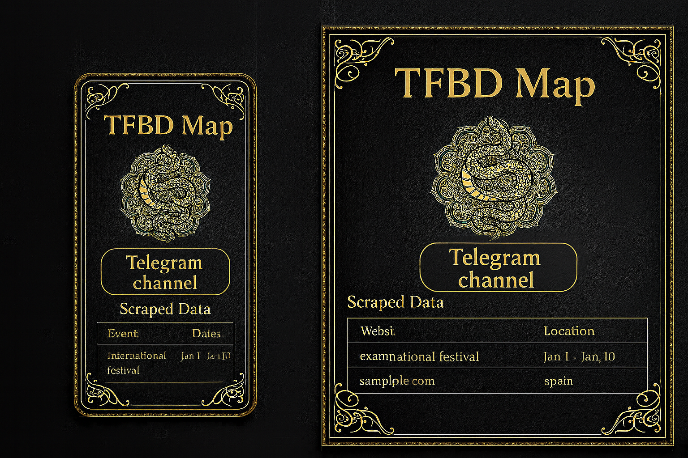

# TFBD Map

As a Tribal Fusion Belly Dance enthusiast, I want to attend global festivals and stay informed about events happening around the world.

>

But, the TFBD community is currently underserved and **scattered**, with no single platform offering comprehensive information.

To stay updated, one has to follow multiple Instagram pages and rely heavily on recommendations or friends’ knowledge. There is no one-stop solution to discover everything in one place.

So, I want to create an app that scrapes data in real time and presents it through a clean dashboard.

To begin with, the app will display information such as:

- Event or festival name

- Location

- Dates

- Registration links

- Details about special guests

Here’s a mockup:

Eventually, I envision this becoming a one-stop solution for the global TFBD community — a place where dancers can look up teachers and book classes, and where collaboration thrives.

For example, artists could post requests like:

- “Looking for 2 dancers with intermediate belly dance experience for an Instagram reel shoot”

- “Need a partner for a Bollywood duet”

- “Seeking help with choreography”

Ultimately, I want to build a platform that **connects** the TFBD community worldwide.

---

#### Why Make It?

- **Scattered Information**: Dancers currently find event details by tracking individual Instagram or Facebook pages.

- **No Filters**: There’s no global calendar with filters by country, event type (festival/workshop/gala), or date.

- **No Community Hub**: The TFBD world lacks a centralized digital ecosystem built for its needs.

---

#### Plan

1. **Phase 1**: Launch a real-time event dashboard using a web scraper backend.

1. **Phase 2**: Add scheduling features for teachers and artists.

1. **Phase 3**: Enable collaboration posts and community features.

Here is the protopype of the app: [https://satavisha.github.io/TFBDMap2/](https://satavisha.github.io/TFBDMap2/)
