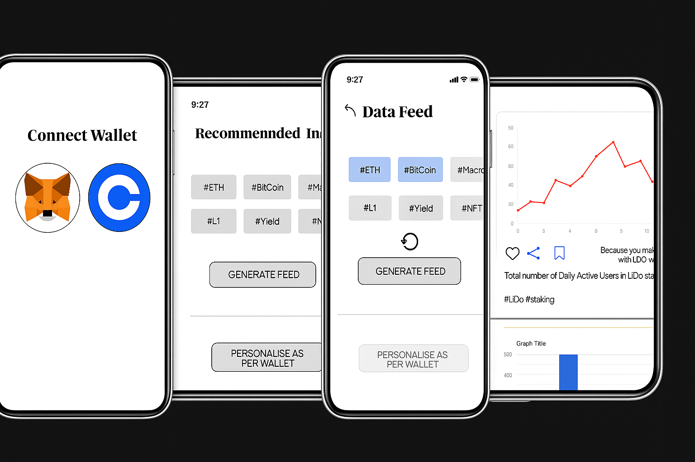
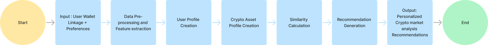

# Defi GPT: from blockchain noise to actionable insights; an AI powered tool for Crypto traders

[Open Figma prototype](https://www.figma.com/proto/TjES27Fx5EXwntbP7lbLON/ChatGPT-Project?type=design&t=CyjweznMCT2PkuCB-0&scaling=scale-down&page-id=0:1&starting-point-node-id=8:422&show-proto-sidebar=1)

Defi GPT is a blockchain-based platform utilizing a Generative Engine and Retrieval Augmented System to curate insights for users. Integrates NFT collections, and diverse data APIs for comprehensive market analysis. (for e.g. DUNE analytics, Covalent, Airstack)

### 
Here’s the prototype: ‣

>

> **Our Vision**: Bridge the gap between raw blockchain data and actionable decisions for crypto investors

#### Why Build it?

The breadth and complexity of blockchain data make it challenging for individuals without a background in data analysis to derive meaningful insights. Such a tool is aimed at simplifying this complexity, allowing users to gain a deep understanding of the crypto marketplace.

#### Who is it for?

**Traders, NFT Collectors, web3 investors **who want to understand the working of the crypto market and get insights, so that they can understand the working of particular tokens/ NFTs/ etc and take investment decisions.

For in depth product details like Market Viability and STP, head to → ‣

#### **Solution Overview**

The platform will feature two proprietary technologies: **Wallet2Vec**, for superior wallet segmentation, and a **Recommendation Engine **for personalized investment and trading recommendations. It will analyse various blockchain data types, including Token Data, DeFi Protocols Data, Smart Contract Interactions, Governance and DAO Activities, GameFi, NFT, and Transaction Data.

#### Description of metrics for each type of blockchain:

| Blockchain Data Type | Metrics |
| --- | --- |
| Token Data | Token balances, Transfers, Ownership history, Market capitalization, Volume, Price changes, Liquidity |
| DeFi Protocols Data | Lending rates, Liquidity pool sizes, Token swap volumes, Total value locked (TVL), Yield rates |
| GameFi | DAU, Average Transaction Volume, Token Circulation, Liquidity |
| NFT | Total number of transaction in NFT Marketplace |
| Transaction Data | Transaction hashes, Value transferred, Transaction volume  |

### Functional Requirements

**Wallet2Vec**
Proprietary technology using wallet embedding powered by transformer architecture to create superior wallet segmentation. Each wallet embedding is trained on a sequence of transactions.

**Recommendation Engine**
A personalized recommendation engine which deeply understands the user's style of trading and investment and recommends **[Visualisations](https://yudai.app/#)**[.](https://yudai.app/#)

**Data Integration:** Incorporates comprehensive market analysis using blockchain data types specified in the metrics table, facilitated by a SQL language and integration with diverse data APIs.

### User Flow:

