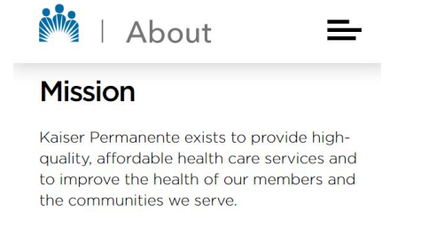
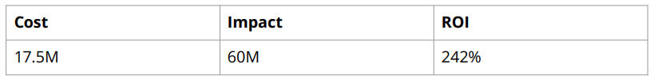

# KPHealth - a Health app for Kaiser Permanente

### Resources:

[KPhealth_Product Pitch.pdf](./assets/02-59a8d940-217c-4d51-b255-537324153613.pdf)

[KPHealth_ Developing the Product.pdf](./assets/03-5a7b8634-0117-43fd-a0a7-8dc4805916b1.pdf)

[KPhealth_satavisha.pdf](./assets/04-0359eb46-cbe6-4b87-b245-1c0b8f9473f5.pdf)

[Open embed](https://www.figma.com/proto/WkYekgiDDk23svb5x0H11o?embed_host=notion&kind=&node-id=104-89&page-id=0:1&scaling=scale-down&starting-point-node-id=104:89&t=V6BBEyyDVtZ6vVlh-0&type=design)

### Background

***Why are we here? ***
•An app to help KP members stay on top of their health routine.
•Special focus on Diabetes prevention and treatment.

### Initial Focus

***Where are we starting?***

• High risk of preventable disease
– 34M (10.5% of the U.S. population) have
diabetes. [[1](https://diabetesresearch.org/diabetes-statistics/)]
– 90-95% have Type 2 diabetes
– 88M have prediabetes, majority uninformed [[2](https://www.cdc.gov/diabetes/basics/prediabetes.html)]

• US becoming more and
more health aware
– Young generation is more
aware about fitness.

• High cost of healthcare
– 327B expenditure on diabetes treatment. [[4](https://pubmed.ncbi.nlm.nih.gov/29567642/)]
– 66% of the US population fears that they cannot afford healthcare. [5]

### Opportunity

***What’s the problem?***

- **$430 Billion Market**: KPHealth has a significant opportunity in the $430 billion diabetes market in the USA.

- **$7 Billion Sector**: The US health coaching market, valued at $7 billion, presents strong growth potential for KPHealth.

- **Digital Advantage**: KPHealth benefits from the ease of digital tools and a competitive edge in a digitizing healthcare landscape.

![Average expenditure per capita of US: $11K \[7\]](./assets/06-3cf8cecb-e5ad-4f7c-8143-60a8d40bde3e.png)

### Return On Investment

***What can we do?***

**The development cost for the app in the initial year:**
(2 Android, 2 IOS Developers) → $600k
Testing, support, sales, and project manager                                           → $700k
Marketing (PR outreach, ads, SEO)                                                          →  $300k
Product Manager                                                                                     →  $150k
Estimation of revenue 
(10% of members {~1.2M} buying premium at $5/month)                      → ** $60M**

### Roadmap Pillars

***Where do we go from here?***

• Our app focuses on preventative care
– Habit forming, improving quality of life
– Cutting down medical costs by preventative measures
– Connects users and experts for tailor-made healthcare
• Strategic pillars
– Personalised healthcare plans
– Community building
– Increasing health awareness

### Onboarding on programs

***Speed up and onboard***

• Onboarding more preventable diseases (heart disease, PCOS, etc)
• Improved AI chatbot
• Connecting 24/7 hotline
• Partnering up with gyms, local supermarkets, e-commerce companies

### Where do we go from here?

***Widening the Scope*** 
• Enhance functionality
• Leverage use of AI
– Develop chatbots and targeted health advice
• Integration with smartWatch, pulse oximeter (get accurate results)
• Establish a marketplace
– Connect doctors, dieticians and coaches
• Extend for mental wellbeing

#### Product Development

The following is the ***[Project Coordination Map](https://docs.google.com/spreadsheets/d/13-kPSwprTsfEO1TGGxZ8ZOPCeCSykbPHZD4dcTRuzUU/edit#gid=158883148)***

#### Marketing and Pricing Strategy

***Acquisition Channels***

- App Stores - Make our product easily accessible through both Apple App Store and Google Play Store.

- Influencer Marketing - Partner with health and wellness influencers who have authentic connections with their audience and can relate to everyday health concerns better than traditional celebrities.

- Search Engine Optimization - Optimize website content and structure to improve search engine rankings, helping us reach our target market more effectively.

#### Email Marketing to KP Members

- Strategic advertising placement at healthcare touchpoints including hospitals, diagnostic centers, and fitness facilities.

#### The revenue goal and explanation

With our app, we will raise awareness about health and encourage people for a healthy lifestyle. We will focus on preventative care and hence, will aim to reduce the cost of treatment of diabetes.

The pricing of $5 per month, with the **[freemium ](/e93e6093cc1c478b90607728e8c18943?pvs=25)**model. Also, the tie-up with gyms will help in revenue gaining.

#### Preparing for launch

***Develop the Pre-Launch Checklist***

Check with the following teams and get their approval:

1. Legal - Privacy Issues

1. Marketing - Blog post, release notes & screenshots

1. Engineering - Tested everything and ready to launch

1. Leadership - Inform leadership that we are ready for launch

1. Define Metrics - Downloads, stability, usage, retention

1. App Store - Submit the app for review

***Anticipate and plan for risks***

- Risk for security breach - To avoid this we have made sure that the product’s data security is in place and given high priority

- Neglecting a plan for post launch - To avoid this we will have a post launch plan where we can observe and improve our product.

- Technical risks - Technical glitches may occur when users start using the app, to avoid this we haves tested the app multiple times and post launch action will be included in the plan
