# Lok Learn - an OTT for Bharat

## Problem Statement

Aimed at Tier 2 and Tier 3 cities in India, where OTT platforms either neglect regional cultures or offer unaffordable pricing. There’s a gap in infotainment and mythological content in regional languages for adults.

Here is the live working prototype in figma! →

[OTT for Bharat](https://www.figma.com/proto/x88ltDVgJLBiCcFZYmi2G0/OTT-for-Bharat?node-id=8-43&t=0icI9175nqzZeu3c-1&scaling=scale-down&page-id=0%3A1&starting-point-node-id=1%3A2&show-proto-sidebar=1)

#### **My Role**

Product Manager (End-to-End Ownership)

- Led strategy, research, product design, and prototyping

- Conducted market research, user surveys, persona creation, and PRD development

- Created the product wireframes and[ low-fidelity prototype in Figma](https://www.figma.com/proto/x88ltDVgJLBiCcFZYmi2G0/OTT-for-Bharat?node-id=8-43&p=f&t=J6IEPxOUnB1HZeMc-1&scaling=scale-down&content-scaling=fixed&page-id=0%3A1&starting-point-node-id=1%3A2&show-proto-sidebar=1)

#### **Discovery & Research**

- 📊 Secondary research: Market size projected to reach $12.5B by 2030 with 75% regional content demand

  - **Regional Reigns**: **70–75%** of content consumed is in **Hindi & regional languages**.

  - **Top Segment**: **SVoD** leads, projected at **₹163.8B in 2024**.

  - **User Boom**: **634M users by 2029**; penetration to rise from **34.1% → 42.2%**.

  - **Monetization**: ARPU expected at **₹670.20** in 2024.

  -

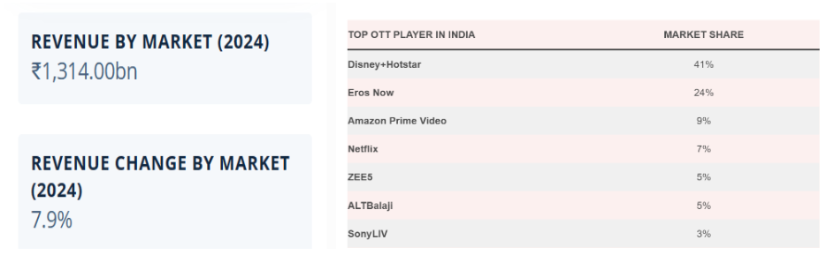

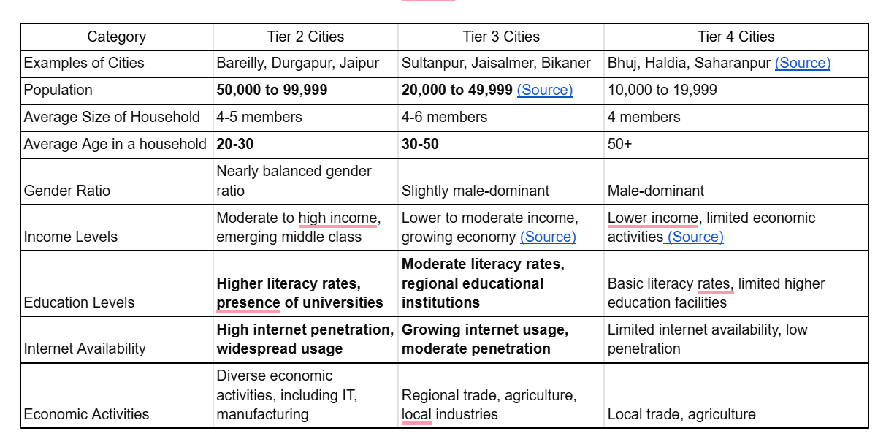

- 👥 Generative user research: [Surveyed ](https://docs.google.com/forms/d/e/1FAIpQLSflVrB4xg7BChhdq3qYJnCk9V9Dz9GdHoGE5r9YNNLT1vT0nw/viewform)10+ users from Tier 2/3 cities, analyzed device usage, preferred content types, and pain points

- 👤 Defined 4 key personas (e.g., homemaker from Asansol, college student from Sambalpur)

#### **Product Vision**

“To be the leading OTT platform in regional languages for Bharat, offering infotainment and mythological content that promotes holistic learning at an affordable price.”

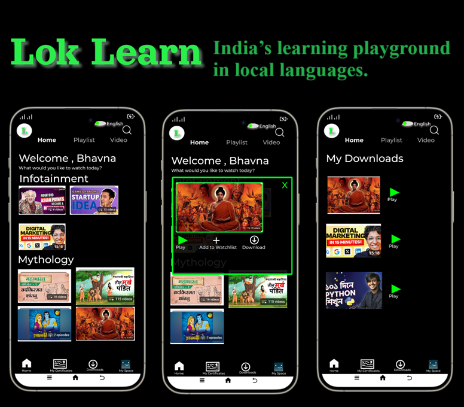

#### Prioritised solutions with differentiated features

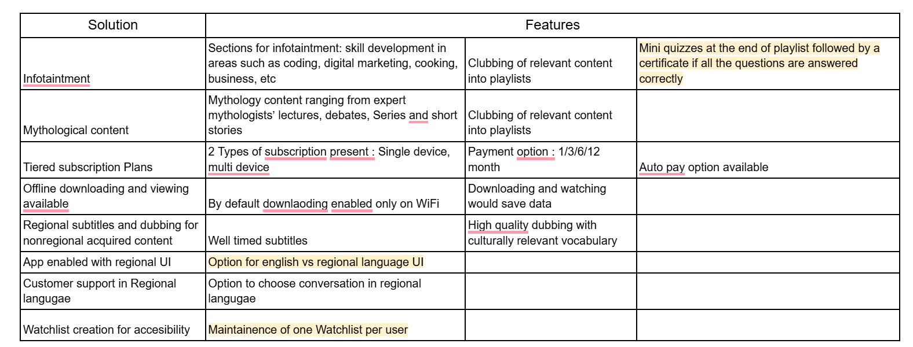

- 📚 Infotainment + Mythology playlists

- 🏆 Certificate & quizzes post-playlist

- 🌐 Regional language UI & subtitles

- 📲 Offline downloads, tiered subscription pricing

- 📺 Auto-play, suggestions, trailers, and watchlist

>

Additionally, what sets the app apart:
**Skill development** and mythological content (in** regional language**) ,
available in a **tiered subscription model**.

#### MVP

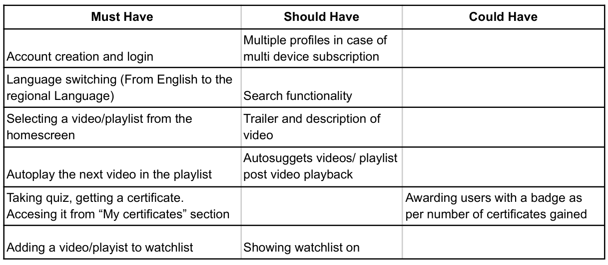

#### Use Case

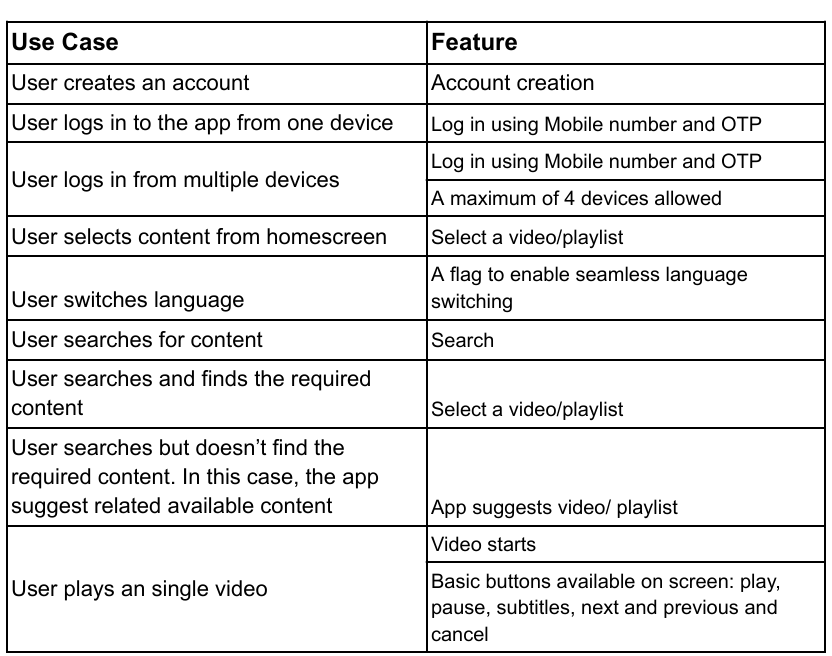

#### Functional Requirements

Hereby showing a few functional requirements, brought to life. I convey the best with images, hence, here are some workflows :

1. Language Switching

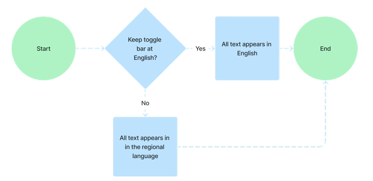

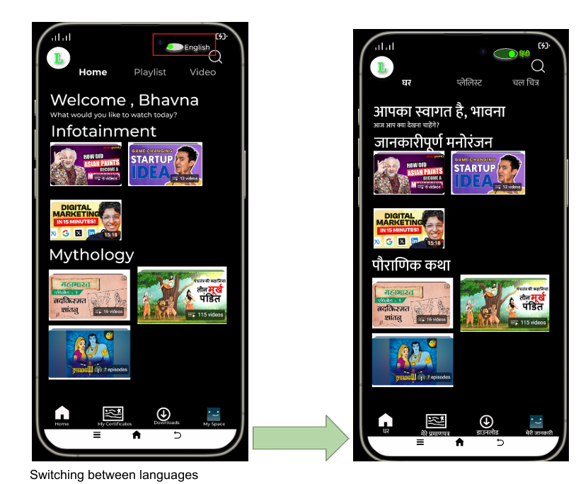

Functional Requiremnet: Accurate translation from English to Regional Language, Up to date
regional language library with accurate symbols

1. Certification at the end of a skill development playlist

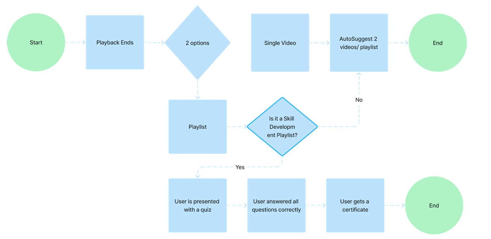

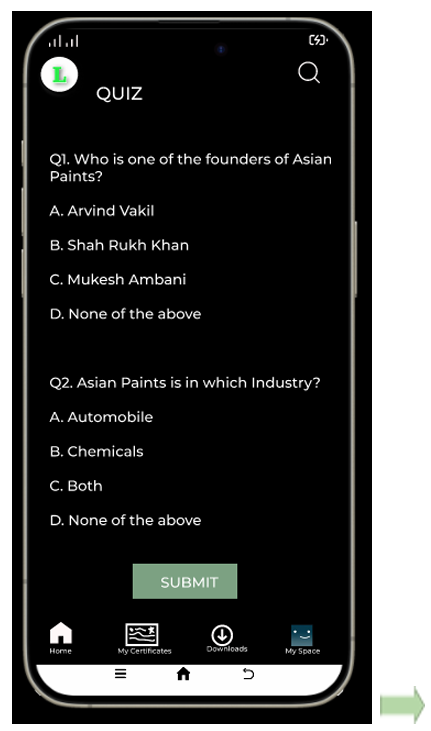

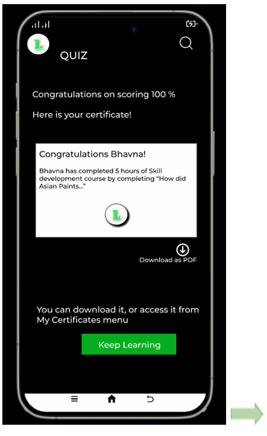

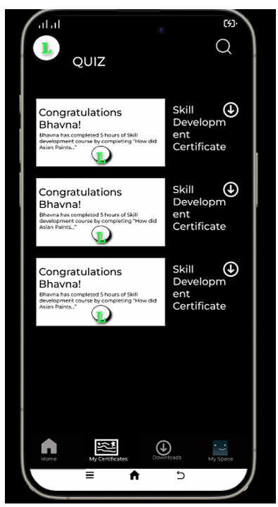

Completing a quiz successfully and getting a downloadable certificate.

Additionally, I want to test a hypothesis:

Hypothesis: Providing downloadable certificates improves customer engagement and retention by 10% in 1 month.
**Success Metric tied to the Hypothesis**

1. No. of certificates downloaded by the user

1. Accuracy of answers in the quiz

1. How many times a video is replayed/ paused

1. Number of videos watched by the user

1. Number of quizes taken by the user

1. Certificates being uploaded on LinkedIn and Lok Learn being tagged

1. Time spent on app

1. Feedback from users (CSAT Score)

1. Churn rate

1. Drop off rate while watching a video

1. Drop off rate while taking a quiz

1. Number of people agreeing to take a quiz after a playlist ends

####
